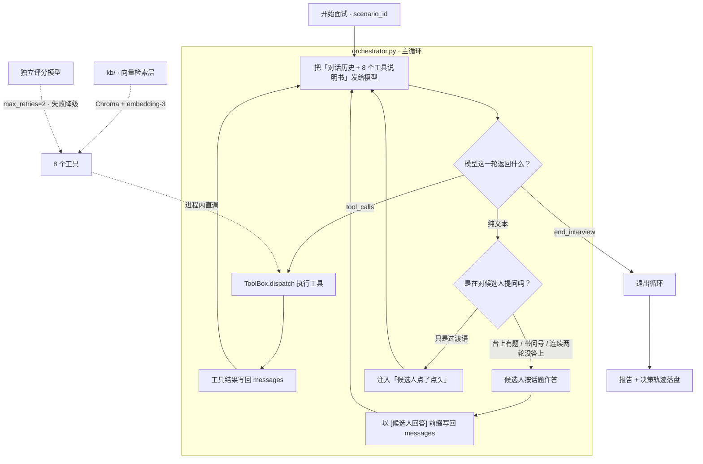

# MockMate

> **拿自己的简历练一整场面试，然后拿到一份逐题打分的复盘报告。**
>
> 这是一个**自研的 LLM Agent 调度循环**：模型自己决定下一步做什么——读简历、检索岗位情报、出题、追问、打分、交报告、结束，
> 循环什么时候停也由它判断。**决策循环是这个仓库自己写的代码，不依赖任何 Agent 框架。**

   

---

## 1. 它能做什么

**输入**：一份简历 + 一个目标岗位 JD（都在 `scenarios/*.json` 里）
**输出**：一场约 30 轮的多轮面试 + 一份结构化复盘报告

```bash
python -u orchestrator.py --scenario backend_intern
```

面试官是 LLM，候选人由脚本模拟（刻意的，这样每次跑都可复现、不烧人工）。
报告里有 6 维雷达、亮点 / 短板、7 天训练计划，以及**逐题评分明细**——每道题都带维度得分、点评、和判分依据原文。

一场真实运行的最后几行长这样：

```
 轮数            : 32
 工具调用次数    : 20
 出题数 / 评分数 : 7 / 7
 平均分          : 5.14
 评分来源        : LLM 7 题 / 规则降级 0 题
 结束原因        : 面试完成，已提交复盘报告
 耗时            : 162.4s
 LLM 调用 / token: 39 次（其中评分 7 次）, 278364 in + 5860 out
```

---

## 2. 架构



整个 Agent 的本质就是上面这四步转圈：

1. 把当前对话历史 + 工具说明书发给模型
2. 模型要么**说话**，要么**要求调用某个工具**
3. 要调工具 → 我们执行 → 结果塞回对话历史 → 回到 ①
4. 只是在说话 → 那就是在跟用户交互 → 把对方的话接上 → 回到 ①

**停止条件不是写死的，是模型判断的**（它调用 `end_interview` 时）。这就是所谓「自主性」。

### 模块职责

| 文件 | 职责 | 一句话 |
|---|---|---|
| `orchestrator.py` | **主循环** | 组装请求 → 模型决策 → 执行工具 / 候选人作答 → 写回 → 循环 |
| `agent/llm.py` | LLM 客户端 | requests 直打 OpenAI 兼容端点，含统一指数退避重试；`chat()` + `embed()` |
| `agent/tools.py` | 8 个工具 + `ToolBox` | 工具的 JSON Schema 说明书 + 会话状态 + `dispatch()` |
| `agent/prompts.py` | 系统提示词 | 面试官的行为准则（由平台时代的 `Agent.md` 改写而来） |
| `agent/candidate.py` | 模拟候选人 | 题库题按 id 精确匹配，追问题按**话题池**作答，池子轮完一圈会认输 |
| `agent/evaluator.py` | 单题评分器 | LLM 判断维度达成度 → 代码算加权总分 → 失败降级为规则打分 |
| `kb/store.py` | 知识库入库 | 按 markdown 标题切小节 → 向量化 → 写 Chroma |
| `kb/search.py` | 检索层 | `retrieve(query, k)` 返回片段 + 相似度 |
| `kb/build.py` | 建库 CLI | `python -m kb.build [--rebuild] [--show]` |
| `knowledge/*.md` | 面试情报语料 | 面试流程 / Redis 考点 / HTTP 考点 / 系统设计框架 |
| `tools/mock_tools.py` | 场景数据 + 报告渲染 | 题库、简历、JD，以及 markdown 报告的生成 |

### 8 个工具

`read_resume` · `fetch_jd` · `search_jd_kb` · `pick_question` · `log_custom_question` · `score_answer` · `submit_report` · `end_interview`

> `log_custom_question` 是踩坑之后补的：提示词要求「项目深挖题自己拟」，
> 又要求「评分必须带 question_id」——两条互斥，模型只能编一个 id 然后被拦下。
> **模型编参数往往是"聪明"的应对，错的是工具集没给它合法路径。**

---

## 3. 实测结果

下面是一次完整运行的真实数据（`glm-4.5-air` 当面试官 + `glm-4-flash-250414` 当评分官）。
证据文件在 [`docs/examples/`](docs/examples/)：决策轨迹 + 完整报告都在里面。

| 指标 | 值 |
|---|---|
| 轮数 / 工具调用 | 32 / 20 |
| 出题 / 评分 | 7 / 7 |
| **评分来源** | **LLM 7 题，规则降级 0 题** |
| 平均分 | 5.14 / 10 |
| 结束原因 | 面试完成，已提交复盘报告（**模型自主收尾**） |
| 耗时 | 162.4s |
| LLM 调用 / token | 39 次（其中评分 7 次），278364 in + 5860 out |

分项均分：**算法题 9.0 · 项目深挖 0.0 · 系统设计 3.0 · HR 行为面 6.0**（10 分制）——区分度是真实的。

逐题（报告里每题都有维度得分 + 点评 + 判分依据）：

| 题目 | 分 | 最能说明问题的一维 |
|---|---|---|
| 岛屿数量（算法） | 9 | 边界 `0.40` —— 它确实没提边界处理 |
| 项目深挖（答"没做过压测"） | **0** | 四个维度全是 0 —— 确实没有任何实质内容 |
| 短链设计（只答了并发安全） | 3 | 数据模型 `0.00`、接口设计 `0.00`、权衡 `0.00` |
| HR · 自我介绍 | 7 | 真实度 `0.60` |
| HR · 动机（一句空话） | 5 | 真诚度 `0.40`、思考深度 `0.40` |
| HR · 抗压 | 7 | 四项各 `0.70` |
| HR · 职业规划 | 5 | 可行性 `0.40`、动机 `0.40` |

### 评分器换掉前后（单题对照）

第一版评分器是 `按字数打分`：`len(answer) < 20 → 3`，`< 100 → 6`，否则 `8`。
它量的不是「答得好不好」，是「答得长不长」。

| 答案 | 字数 | 旧评分器 | 新评分器 |
|---|---|---|---|
| A 长但空洞（纯套话） | 241 | **8** | **0** |
| B 短但准确 | 134 | 6 | **7** |
| C 只答一半 | 29 | 6 | **3** |
| D 完全不会 | 8 | 3 | **0** |

排序完全反转。

---

## 4. 快速开始

```bash
# 1) 装依赖
pip install -r requirements.txt

# 2) 配置 Key（.env 已在 .gitignore 里，永远不会被提交）
cp .env.example .env        # Windows: copy .env.example .env
#   然后编辑 .env，填入 ZHIPU_API_KEY

# 3) 建向量库（可选：不建也能跑，检索会自动回退到内置的少量情报，不会中断面试）
python -m kb.build

# 4) 跑一场面试
python -u orchestrator.py --scenario backend_intern
```

**两个容易踩的点**：

- `python -m kb.build` 必须在仓库根目录执行（`-m` 依赖当前目录在 `sys.path` 里）。
- 跑面试要加 `-u`。不加的话 Python 会缓冲输出，重定向到日志文件时你会一直看到 0 字节，没法判断进度。

### 想先跑个不花钱的自检

```bash
python e2e_test.py     # 离线跑一遍工具链路，不调模型、不消耗额度
```

### 跑测试

```bash
python -m pytest tests -v     # 117 项，离线，不需要 API Key
```

单测只覆盖**确定性**的部分——也就是"能被机器判定对错"的那些：

| 文件 | 测什么 |
|---|---|
| `tests/test_tools.py` | 入参校验（非法 track/difficulty/stage 必须被拦）、`pending_question` 状态流转、业务错误不能被当成成功、自拟题 id 生成、评分落账、报告总体分与逐题分对齐、检索失败 ≠ 检索为空 |
| `tests/test_evaluator.py` | 从模型的自由发挥里抠 JSON、量纲归一（0.8 / 8 / 80 / "0.8"）、键名模糊匹配、加权计算、**覆盖率 < 60% 判失败**、熔断器、缓存、降级标记 |
| `tests/test_kb.py` | 按标题切分且不串知识点、无空行文本退回按行切、超长段落硬切带重叠、片段 id 内容指纹、`distance → 相似度` 换算 |

三条刻意写进测试的**设计约束**（以后有人"顺手"改掉会立刻红）：

- 评分请求里**只有「系统提示 + 这一道题」**，不带整场对话历史——`test_scoring_prompt_has_no_conversation_history`
- 降级打分必须**标出来**，不能假装没降级——`test_fallback_marks_reason_that_it_is_degraded`
- 题库里每个评分维度在提示词里都**必须有中文释义**——`test_every_bank_rubric_dimension_has_a_hint`

> 单测不碰真实 LLM 调用：评分器用一个假客户端顶替，报告落盘写到临时目录
> （否则每跑一次测试就把仓库里那份真实报告覆盖掉）。

### 常用参数

| 参数 | 作用 |
|---|---|
| `--scenario` | 场景 ID，目前有 `backend_intern` |
| `--model` | 面试官模型，默认取 `.env` 里的 `CHAT_MODEL` |
| `--score-model` | 评分模型，默认与面试官相同。可用来错开限流，或换更强的模型判分 |
| `--no-llm-score` | 用规则打分替代 LLM 评分，调试流程时省额度 |
| `--max-turns` | 最大轮数（保险丝），默认 30 |
| `--quiet` | 只输出统计，不打过程 |

退出码：`0` = 报告已生成，`1` = 没生成报告（两者都可能是"跑完了"，看报告才准）。

---

## 5. 设计决策

这一节是这个仓库真正值钱的部分。每条都可以在面试里讲三分钟。

### 5.1 决策循环自己写，不用框架

用 LangChain / AutoGPT 之类的框架，你得到的是一个能跑的系统，但学不到"Agent 到底在干什么"。
这个循环的核心只有几十行，写一遍之后，任何 Agent 框架的内部对你都不再是黑盒。

### 5.2 工具失败不抛异常，把错误当结果交回模型

`ToolBox.dispatch()` 返回 `(ok, payload)`，业务错误也走"成功"这条通道写回 `messages`。
模型下一轮看到「id 不存在」会自己换个参数重试——**这是 JD 里常写的"失败恢复"最朴素也最有效的一层。**

`score_answer` 报错时还会附一句 `hint`，告诉它「合法 id 怎么拿」。
只说"你错了"没有用，得给它一条能走通的路。

### 5.3 边界判断靠状态，不靠猜字符串

第一版用「句子里有没有问号」判断模型是在提问还是在自言自语。
结果整场面试卡死：面试官出题用的是「请实现……请说明……」这种祈使句，**一个问号都没有**，
被判成自言自语 → 注入"候选人点了点头" → 面试官以为题没问出去 → 再问一遍……**30 轮全在空转，一道题没出。**

现在改成三级判定，任何一级命中就给候选人回答的机会：
有题在台上（`pending_question` 状态）→ 句子里有问号 → 连着两轮没答上（防死循环的保险丝）。

**教训：边界判断不能靠猜字符串，要靠状态。**

### 5.4 Agentic RAG：检索是工具，不是管线

同一个作者写的 [`rag-knowledge-assistant`](https://github.com/spike5321/rag-knowledge-assistant) 是**固定管线**：
`retrieve → 拼 prompt → 生成`，模型的权限只到"写答案"为止。

在 MockMate 里，检索是一个**工具**：模型自己决定**查什么**、查几次、拿到片段怎么用。
实测这一场里模型自发检索了两次，query 是自然语言：

- `Redis缓存三大问题怎么答`
- `分布式系统高并发场景设计`

而且检索结果真的影响了输出——报告的改进建议里出现了 `Cache Aside、延时双删`、`Redlock`，
这些正是 `knowledge/redis_points.md` 里的内容。不只是"调了一下"。

**这条分工就是 Agentic RAG 和固定管线的分界线。**

### 5.5 评分链路：模型判断，代码算分

四个设计上的讲究，每一个都是踩出来的：

1. **模型只给「每个维度的达成度」，加权总分由代码算。**
   模型做判断很行，做算术很不稳——让它自己算总分，十次里会错两三次，而且错得悄无声息（数字看着挺合理，你不会去复核）。
   提示词里专门写了一句「不要在 comment 里写分数」。
2. **评分器看不到对话历史。** 每次只发「题目 + 参考要点 + 这一条回答」。
   否则会有**光环效应**：同一条答案放在开场评和放在最后评，分数不一样，那这个分数就没法横向比较——
   而复盘报告的价值恰恰在于可比。顺带也省了大量 token。
3. **覆盖率保护。** 模型只给一两个维度就想交差时，如果给其余维度补中性值，会把分数拉到"看着还行"的位置，
   比直接没分更危险。所以覆盖率 < 60% 直接判失败、走降级。
4. **失败要降级，而且要标出来。** LLM 挂了不能崩整场面试，退回规则打分并标 `source="rule-fallback"`，
   报告里能看出哪几题是降级评的。**降级不是丢人的事，假装没降级才是。**

另外：权重表来自**题库自带**的 `scoring_rubric`（例如 LRU 那道题是
`{data_structure_choice: 3, time_complexity: 3, edge_cases: 2, code_clarity: 2}`，合计 10）。
这个字段从第一天就在数据里躺着，旧的假评分器**从来没用过它**。
→ **接手一个已有项目时，先读数据再写代码，标准可能早就定好了。**

### 5.6 出题和判卷用不同的模型

两个**独立客户端**、两套重试策略：

- 面试官的重试是"必须成功"——整场对话不能断，所以 `max_retries=4`，撞限流时总等待 70 秒。
- 评分失败可以降级，所以 `max_retries=2`（10s + 20s 就放弃，快速降级）。
  让它跟着面试官一起重试 4 次，等于**拿整场面试去赌一道题的分**（这是真出过的事故）。

再加上智谱的 429 是**按模型**报的（原文「**该模型**当前访问量过大」），
两个模型各占一份额度，不容易一起被打满。评分调用会让请求数翻倍左右，这一步错开很关键。

附带好处：「出题的」和「判卷的」不再是同一个模型，评分视角更独立，也避免了自我一致性偏差。

---

## 6. 踩过的坑

按发现顺序，全部是真实故障。这张表比上面任何一段设计说明都更能说明"工程"两个字。

| # | 现象 | 根因 | 修法 |
|---|---|---|---|
| 1 | 30 轮空转，一道题没出 | 用"有没有问号"判断是否在提问，而出题是祈使句 | 改为按 `pending_question` 状态判断 |
| 2 | 答非所问 | 答案按 track 索引，题库却随机出题 | 改为按题目 id 精确匹配 |
| 3 | 面试官替候选人做自我介绍 | 答案裸着塞进 `messages`，模型分不清角色 | 加 `[候选人回答]` 角色路标 |
| 4 | 日志显示 `OK` 但实际失败 | `dispatch()` 把业务错误当成功；enum 只是提示不是约束 | 检查 `error` 字段 + 补入参校验 |
| 5 | 自由追问抽干兜底池，候选人永久沉默 | 池子只能取一次 | 改成可循环的应答池 |
| 6 | 面试官把同一句话问 8 遍，36 轮撞上限 | 追问池装的是"具体答案"，接不住别的题 | 池子改成"答题框架"式通用回答 |
| 7 | 追问话题连续误判两次 | 关键词跨话题复用（「缓存」既是算法题也是系统设计题） | 改为**继承上一题的 track**，关键词只留"项目/简历"这类专属信号 |
| 8 | 候选人不肯认输 → 面试官死循环 | 兜底资源只解决"有话可说"，没解决"该结束了" | 池子轮完一圈切换成认输应答 |
| 9 | 项目深挖题永远评不了分 | 提示词要它自拟题、评分又必须要 id，两条互斥 | 新增 `log_custom_question` 让模型登记自拟题 |
| 10 | 一整轮面试在 3.5 秒内结束 | 429 退避是 1s/2s，而限流窗口按分钟计 | 429 单独用 10s 基数（10→20→40s） |
| 11 | 跑到第 17 轮限流，7 分钟成果全丢 | 主循环 `break` 后只退出，不交付 | 新增 `submit_partial_report()`，**宁可交一份残缺但真实的，也不要交一份空白** |
| 12 | 看起来跑完了，实际评分链路完全没生效 | 换了弱模型后它全程自己编题、编 id，13 个评分全被拦 | 入参校验挡住污染 + `questions_asked == 0` 明确报警 |

**第 12 条是这里面最重要的一条**：那次运行有轮数、有 token 统计、有报告，看着像成功。
但它一次都没走过 `pick_question`，报告里没有任何有效评分。

同一条提示词、同一套工具，只换模型，Agent 的行为完全不同——
**「支持 function calling」这个勾，不等于「会在多轮对话里按时序使用工具」。**
所以：**最危险的失败是看起来成功的失败。**

---

## 7. 目录结构

```
mockmate/
├── orchestrator.py              # ★ 主循环（这个项目的核心）
├── agent/                       # Agent 运行时
│   ├── llm.py                   #   LLM 客户端（chat + embed + 重试）
│   ├── tools.py                 #   8 个工具的 Schema 与调度
│   ├── prompts.py               #   面试官系统提示词
│   ├── candidate.py             #   模拟候选人（话题感知 + 会认输）
│   └── evaluator.py             #   单题 LLM 评分器
├── kb/                          # 向量检索层
│   ├── store.py                 #   切分 + 入库
│   ├── search.py                #   检索
│   └── build.py                 #   建库 CLI
├── knowledge/                   # 面试情报语料（4 篇 markdown）
├── scenarios/                   # 场景数据：简历 + JD + 题库 + 候选人脚本
├── tools/mock_tools.py          # 场景加载 + markdown 报告渲染
├── docs/
│   ├── architecture.md          # 架构说明
│   └── examples/                # 一次真实运行的轨迹与报告（可审计）
├── traces/                      # 每次运行的决策轨迹（gitignore，本地生成）
└── e2e_test.py                  # 离线工具自检
```

### 历史遗留

`agents/`（5 个 Agent 定义）、`skills/`（11 个 Skill 定义）、`at/`（AgentTeams 配置）和 `tools/mock_tool_server.py`
是这个项目**早期形态**的产物——那时候决策循环跑在别人的平台上，仓库里只有提示词定义。
现在循环由 `orchestrator.py` 自己实现，这些目录只剩"提示词素材"的价值（`agent/prompts.py` 就是从 `agents/interview-coordinator/Agent.md` 改写来的）。
它们会在后续版本里归档到 `legacy/`。

---

## 8. 已知限制

诚实地列出来，比藏着好：

- **候选人不是 LLM**，是脚本模拟的。这是刻意的（保证可复现、可离线、不烧人工），但意味着"对话的另一半"不是 Agent。
- **没有 Web 界面**，只有命令行。面试过程是流式打印在终端里的。
- **免费模型在晚高峰会被平台级限流**。调试时不要背靠背连续跑整轮面试，中间留几十秒。
- **知识库很小**：4 篇语料、33 个片段。向量检索用的是智谱 `embedding-3`（2048 维），
  没有本地兜底——换 embedding 模型必须 `python -m kb.build --rebuild`（维度不同不能混库）。
- **评分模型只适合单轮无状态调用**。`glm-4-flash-250414` 判分够用，但它不能当面试官（见第 6 节第 12 条）。

---

## 9. 路线图

- [x] **阶段 1** 自研 Agent 调度循环（不再依赖平台）
- [x] **阶段 2** 接入 RAG 检索层（`kb/` + 向量检索 + 面试情报语料）
- [x] **阶段 2.5** 候选人话题感知 + 会说也会认输
- [x] **阶段 3** 真实 LLM 评分（替换按字数打分）
- [x] **阶段 4** 门面 ← 进行中
  - [x] README 重写 + mermaid 架构图 + 实测数据（取自 `traces/`，可审计）
  - [x] `docs/architecture.md` 重写为可上手版本
  - [x] pytest 单测 117 项（离线、不花额度）
  - [ ] Demo 录屏（终端跑一场真实面试）
  - [ ] 旧目录归档到 `legacy/`、`.mailmap` 修贡献图
- [ ] **阶段 5** 多模型路由：模型切换 + 限流时中断询问用户 + checkpoint 断点续跑；本地 embedding 兜底；向量 + BM25 混合检索
- [ ] **阶段 6** Web 界面（Streamlit）：侧栏选模型、填 Key、实时看面试过程

---

## 10. 许可

MIT
