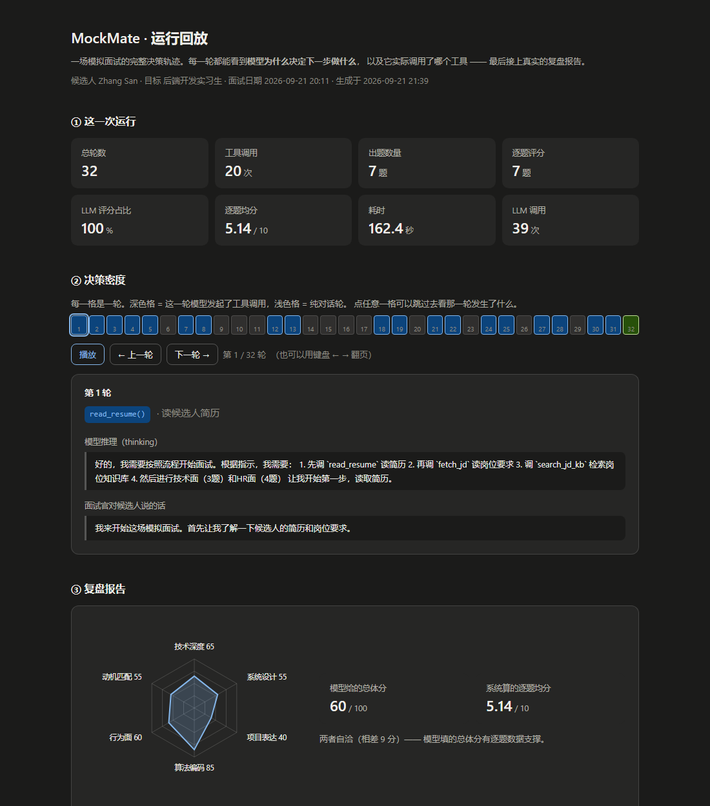
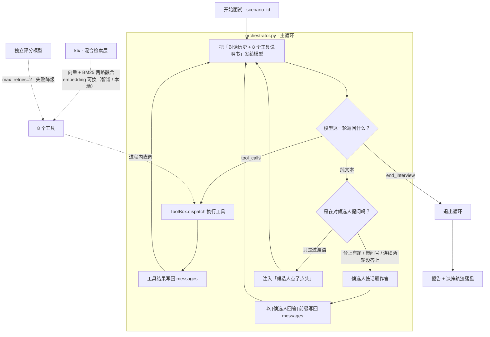

# MockMate

> **拿自己的简历练一整场面试，然后拿到一份逐题打分的复盘报告。**
>
> 这是一个**自研的 LLM Agent 调度循环**：模型自己决定下一步做什么——读简历、检索岗位情报、出题、追问、打分、交报告、结束，
> 循环什么时候停也由它判断。**决策循环是这个仓库自己写的代码，不依赖任何 Agent 框架。**

  

## 真人面试（AI 应用开发岗位）

```bash
pip install -r requirements.txt
streamlit run live_app.py
```

在页面上传 PDF / DOCX / TXT 简历（或粘贴文本），确认解析结果，粘贴目标 JD，填入自己的模型 API Key，然后逐题回答。系统围绕**项目经历、RAG、Agent 与工具调用、评测与工程实践、行为沟通**各问一题，每题最多追问两次、整场最多追问两次；结束后可下载 Markdown 和 JSON 报告。评分只使用程序保存的候选人原话，总分由逐题分计算。简历、回答和 Key 只在当前会话内存中保存；可随时点击“清除本次数据”。会话失效后下一次访问会清除数据，不提供历史回顾；所用模型服务商仍按其自身政策处理请求。

公开部署入口是 `public/app.py`，它有独立的轻量依赖清单。**当前仓库提供部署配置，公开体验链接尚待上线验证。** 真人面试用自己的 Key；原来的 `app.py` 和 `orchestrator.py` 仍是固定场景、脚本候选人的可复现演示。真人面试与原演示的架构和验收说明见 [真人面试说明](docs/live-interview.md)；三份合成简历的真实模型基线及局限见 [评测记录](docs/evaluation-results.md)。

### ▶ 先看这个：一次真实运行的完整回放

**[打开运行回放页](https://spike5321.github.io/mockmate/replay/)** · 32 轮决策轨迹，一轮一轮看**模型为什么决定调那个工具**。



> 回放页是**单文件静态 HTML**（无构建、无依赖、不发网络请求）。Pages 还没开的话，
> 直接下载 [`docs/replay/index.html`](docs/replay/index.html) 双击打开就行；
> 也可以跑 `python tools/build_replay.py` 从轨迹文件重新生成一份来核对。

---

## 1. 它能做什么

**以下是原有脚本演示模式**：输入是 `scenarios/*.json` 中的简历与岗位 JD。
**输出**：一场约 30 轮的多轮面试 + 一份结构化复盘报告

```bash
python -u orchestrator.py --scenario backend_intern
```

面试官是 LLM，候选人由脚本模拟（刻意的，这样每次跑都可复现、不烧人工）。
报告里有 6 维雷达、亮点 / 短板、7 天训练计划，以及**逐题评分明细**——每道题都带维度得分、点评、和判分依据原文。

一场真实运行的最后几行长这样：

```
 轮数            : 32
 工具调用次数    : 20
 出题数 / 评分数 : 7 / 7
 平均分          : 5.14
 评分来源        : LLM 7 题 / 规则降级 0 题
 结束原因        : 面试完成，已提交复盘报告
 耗时            : 162.4s
 LLM 调用 / token: 39 次（其中评分 7 次）, 278364 in + 5860 out
```

---

## 2. 架构



整个 Agent 的本质就是上面这四步转圈：

1. 把当前对话历史 + 工具说明书发给模型
2. 模型要么**说话**，要么**要求调用某个工具**
3. 要调工具 → 我们执行 → 结果塞回对话历史 → 回到 ①
4. 只是在说话 → 那就是在跟用户交互 → 把对方的话接上 → 回到 ①

**停止条件不是写死的，是模型判断的**（它调用 `end_interview` 时）。这就是所谓「自主性」。

### 模块职责

| 文件 | 职责 | 一句话 |
|---|---|---|
| `orchestrator.py` | **主循环** | 组装请求 → 模型决策 → 执行工具 / 候选人作答 → 写回 → 循环 |
| `app.py` | **Web 界面** | Streamlit 页面：选场景/模型、填临时 Key、实时看面试过程、失败可续跑 |
| `agent/llm.py` | LLM 客户端 | requests 直打 OpenAI 兼容端点，含统一指数退避重试与错误分类；`chat()` + `embed()` |
| `agent/providers.py` | 供应商注册表 | 按模型名认出该去哪个端点、Key 读哪个环境变量（换厂商不用改代码） |
| `agent/checkpoint.py` | 断点续跑 | 每一轮落盘；`--resume` 接着跑，跑挂了不用从头开始 |
| `agent/tools.py` | 8 个工具 + `ToolBox` | 工具的 JSON Schema 说明书 + 会话状态 + `dispatch()` |
| `agent/prompts.py` | 系统提示词 | 面试官的行为准则（由平台时代的 `Agent.md` 改写而来） |
| `agent/candidate.py` | 模拟候选人 | 题库题按 id 精确匹配，追问题按**话题池**作答，池子轮完一圈会认输 |
| `agent/evaluator.py` | 单题评分器 | LLM 判断维度达成度 → 代码算加权总分 → 失败降级为规则打分 |
| `kb/embed.py` | 向量化入口 | 按 `EMBEDDING_PROVIDER` 分发到智谱 / 本地模型，**建库和检索共用这一份** |
| `kb/store.py` | 知识库入库 | 按 markdown 标题切小节 → 向量化 → 写 Chroma |
| `kb/bm25.py` | 关键词检索 | 中文按字符二元组切词（零依赖），专有名词靠它才捞得准 |
| `kb/fusion.py` | 两路融合 | 默认归一化加权求和；等权 RRF 保留为可选，实测比单路还差（见第 3 节） |
| `kb/search.py` | 检索层 | `retrieve(query, k, mode, fusion)` 返回片段 + 相似度 + 召回来源；库和配置不是一套时明确报错 |
| `kb/build.py` | 建库 CLI | `python -m kb.build [--rebuild] [--show] [--provider local]` |
| `knowledge/*.md` | 面试情报语料 | 面试流程 / Redis 考点 / HTTP 考点 / 系统设计框架 |
| `scripts/compare_retrieval.py` | 检索质量对照 | 20 个带标注查询 × 五种模式的 Hit@1 / Hit@3 / MRR，用来验证"改进"是不是真的 |
| `tools/mock_tools.py` | 场景数据 + 报告渲染 | 题库、简历、JD，以及 markdown 报告的生成 |

### 8 个工具

`read_resume` · `fetch_jd` · `search_jd_kb` · `pick_question` · `log_custom_question` · `score_answer` · `submit_report` · `end_interview`

> `log_custom_question` 是踩坑之后补的：提示词要求「项目深挖题自己拟」，
> 又要求「评分必须带 question_id」——两条互斥，模型只能编一个 id 然后被拦下。
> **模型编参数往往是"聪明"的应对，错的是工具集没给它合法路径。**

---

## 3. 实测结果

下面是一次完整运行的真实数据（`glm-4.5-air` 当面试官 + `glm-4-flash-250414` 当评分官）。
证据文件在 [`docs/examples/`](docs/examples/)：决策轨迹 + 完整报告都在里面；**逐轮回放见[运行回放页](docs/replay/index.html)**。

| 指标 | 值 |
|---|---|
| 轮数 / 工具调用 | 32 / 20 |
| 出题 / 评分 | 7 / 7 |
| **评分来源** | **LLM 7 题，规则降级 0 题** |
| 平均分 | 5.14 / 10 |
| 结束原因 | 面试完成，已提交复盘报告（**模型自主收尾**） |
| 耗时 | 162.4s |
| LLM 调用 / token | 39 次（其中评分 7 次），278364 in + 5860 out |

分项均分：**算法题 9.0 · 项目深挖 0.0 · 系统设计 3.0 · HR 行为面 6.0**（10 分制）——区分度是真实的。

逐题（报告里每题都有维度得分 + 点评 + 判分依据）：

| 题目 | 分 | 最能说明问题的一维 |
|---|---|---|
| 岛屿数量（算法） | 9 | 边界 `0.40` —— 它确实没提边界处理 |
| 项目深挖（答"没做过压测"） | **0** | 四个维度全是 0 —— 确实没有任何实质内容 |
| 短链设计（只答了并发安全） | 3 | 数据模型 `0.00`、接口设计 `0.00`、权衡 `0.00` |
| HR · 自我介绍 | 7 | 真实度 `0.60` |
| HR · 动机（一句空话） | 5 | 真诚度 `0.40`、思考深度 `0.40` |
| HR · 抗压 | 7 | 四项各 `0.70` |
| HR · 职业规划 | 5 | 可行性 `0.40`、动机 `0.40` |

### 评分器换掉前后（单题对照）

第一版评分器是 `按字数打分`：`len(answer) < 20 → 3`，`< 100 → 6`，否则 `8`。
它量的不是「答得好不好」，是「答得长不长」。

| 答案 | 字数 | 旧评分器 | 新评分器 |
|---|---|---|---|
| A 长但空洞（纯套话） | 241 | **8** | **0** |
| B 短但准确 | 134 | 6 | **7** |
| C 只答一半 | 29 | 6 | **3** |
| D 完全不会 | 8 | 3 | **0** |

排序完全反转。

### 向量检索：换成本地模型之后（对照实测）

检索层的向量化支持两个 provider。同一套语料（4 篇 / 33 片段）、同一组问题，
两边各建一次库，只取 Top1：

| 问题 | 本地 `bge-small-zh-v1.5`（512 维） | 智谱 `embedding-3`（2048 维） |
|---|---|---|
| 缓存击穿怎么处理 | **0.695** 【2. 缓存击穿】 | 0.494 【2. 缓存击穿】 |
| 分布式锁怎么实现 | **0.753** 【五、分布式锁】 | 0.634 【五、分布式锁】 |
| 系统设计题该怎么组织回答 | **0.676** 【解题框架与常见题目】 | 0.564 【四、回答时的常见失分点】 |
| 自我介绍怎么讲 | 0.542 【四、面试准备建议】 | 0.352 【HR 面】 |
| 团队协作里遇到过什么冲突 | 0.532 【HR 面】 | 0.426 【HR 面】 |
| 数据库索引为什么用 B+ 树 | 0.564 【六、幂等性】 | 0.471 【三、常被追问的权衡表】 |

怎么读这张表：

- 前三行是语料里**明确写了**的东西，两边都落到同一份文档 —— 本地不输，
  「系统设计题怎么组织回答」还更贴（本地命中【解题框架】，智谱命中相邻的【常见失分点】）。
- 最后两行问的东西语料里**没有对应章节**，两边都是"矮子里拔将军"。
  但注意分数：本地对真命中给 0.68~0.75、对瞎命中给 0.53~0.56，**有区分度**。
- **分数不能跨 provider 比较** —— 同一个问题、命中的还是同一个片段，
  本地给 0.695、智谱给 0.494。这就是"换模型必须重建库"的真正原因：
  混着用不会报错，只会让排序失去意义。

结论：**这个语料量级下，512 维换成 2048 维没有收益。**
本地模型的价值不在准确率，在**免 Key 免网络** ——
评审 clone 下来不填任何配置，检索这一层也能跑起来。

### 混合检索：加了关键词这一路之后（对照实测）

向量路比的是**语义**，但它对**专有名词**很弱（「RDB」「Redlock」「TIME_WAIT」在向量空间里
和周边概念挤成一团）。所以补了一路 BM25 关键词检索。加了这一层到底有没有用，得量。

20 个带标注的查询（每条都对应语料里一个具体小节），五种模式各跑一遍。
语料 4 篇 / 33 片段，向量模型用本地 `bge-small-zh-v1.5`：

| 模式 | Hit@1 | Hit@3 | MRR | 专有名词型 Hit@1 | 换说法型 Hit@1 |
|---|---|---|---|---|---|
| 向量单路（= 加这一层之前） | 50% | 75% | 0.617 | 50% | 50% |
| 关键词单路（BM25） | 70% | 85% | 0.767 | **80%** | 60% |
| **混合（默认：归一化加权求和）** | **70%** | **85%** | **0.767** | 70% | **70%** |
| 混合（第一版实现：等权 RRF） | 60% | 80% | 0.700 | 70% | 50% |

- 「专有名词型」= 查询里写了目标小节的关键术语；「换说法型」= 一个都没写，只能靠语义对上。

怎么读这张表：

- **混合没有把总体命中率抬起来** —— 它和最强的单路（关键词路）打平。
  所以「混合检索一定更好」这话是错的，**别写进简历**。
- 它真正补上的是**换说法型**：70%，而两个单路最好只有 60%。
  这正是加这一层的初衷 —— 语义路补关键词路的短板，而不是反过来。
- 它在任何一个族里都**不低于**任一单路（最低也是持平）。
- **第一版实现（等权 RRF）比两个单路都差。** 这条值得单独讲，见下。

为什么把 RRF 换掉：RRF 给每路的第 1 名都记 `1/(k+1)` 分 ——
**两路的第一名必然同分**，于是两路意见不一致时，谁在前只能靠 id 排序碰运气。
想靠调小 `k` 让名次起作用？从 1 扫到 60，Hit@1 全是 60%，纹丝不动：
`k` 调大了，8 条列表里第 1 名和第 8 名只差 11%（1/61 vs 1/68），融合退化成"数一条片段出现在几路里"；
`k` 调小了，第一名打平的问题更突出。换成"每路各自归一化到 0~1 再等权相加"就没有这个死结。

**老实交代证据强度**：70% 和 60% 的差别是 20 个查询里的 2 个，
**算不上「更准」的统计证据**。站得住的是那条结构性区别（第一名必然同分），它有单测钉住。
给关键词路加权重能把 Hit@3 刷到 90%，但那个假设（"关键词路更强"）换个语料就不成立，
属于过拟合这份语料，所以**刻意给两路等权**。

复现：`python scripts/compare_retrieval.py`（基线是**从 git 历史原样抄**的旧实现，
不是凭印象重写的近似版；脚本开头会自检基线是否仍然成立，对不上就拒绝出结论）。

未实测：全部数字来自**本地**向量模型。智谱 `embedding-3` 那一路本轮因限流没跑，
换 provider 后两路的强弱关系可能变化，结论要重跑 —— 这也是等权 RRF 没删、
保留成 `fusion="rrf"` 选项的原因。

---

## 4. 快速开始

```bash
# 1) 装依赖
pip install -r requirements.txt

# 2) 配置 Key（.env 已在 .gitignore 里，永远不会被提交）
cp .env.example .env        # Windows: copy .env.example .env
#   然后编辑 .env，填入 ZHIPU_API_KEY

# 3) 建向量库（可选：不建也能跑，检索会自动回退到内置的少量情报，不会中断面试）
python -m kb.build

# 4) 跑一场面试
python -u orchestrator.py --scenario backend_intern
```

或者用界面跑（可选，需要 `streamlit`）：

```bash
streamlit run app.py        # 浏览器打开 http://localhost:8501
```

> **第 3 步不填 Key 也能跑。** 没配 `ZHIPU_API_KEY` 时向量化会自动改用本地模型
> （`BAAI/bge-small-zh-v1.5`，512 维，首次运行下载约 91MB，之后完全离线）。
> 想显式指定：`python -m kb.build --provider local`。
> 跑面试（第 4 步）仍然需要 Key —— 面试官和评分官是远程模型。
> **界面里可以现场填一个 Key**，见下面「用界面跑」。

**三个容易踩的点**：

- `python -m kb.build` 必须在仓库根目录执行（`-m` 依赖当前目录在 `sys.path` 里）。
- 跑面试要加 `-u`。不加的话 Python 会缓冲输出，重定向到日志文件时你会一直看到 0 字节，没法判断进度。
- **换 embedding 模型（含 `local` ↔ `zhipu` 之间切换）之后必须 `--rebuild`**。
  不重建的话，检索**不会报错**，只会返回一堆无意义的相似度 ——
  两种模型的向量空间不可比。所以这里做了个显式检查：库和当前配置不是一套时会直接报错并告诉你重建命令。

### 用界面跑（`app.py`）

侧栏选场景和模型，主区实时滚动面试过程，跑完直接看报告。

**为什么它能"实时"**：主循环的所有输出都走 `orchestrator.emit()`，
界面把输出目标换成一个队列、从队列里取着往页面上刷。
**不需要去重定向 `sys.stdout`** —— 那样在 Streamlit 的多线程里不安全，
而且只能拿到一坨裸文本，拿不到"第几轮、调了哪个工具"。

**可以在界面上临时填一个 Key**（侧栏「用自己的凭据」）：填了就优先用它、覆盖环境变量。
★ **它只在内存里** —— 不写 `.env`、不进断点、不进 trace。
输入框是密码类型，因为演示的时候会共享屏幕。
有一条测试专门跑完整场之后翻遍落盘的 JSON，确认里面没有 Key。

**两条和命令行不一样的地方**（是设计取舍，不是没做）：

- **网页里不会停下来问你**。终端那套「限流了，等 60 秒 / 换模型 / 改 Key / 放弃」的菜单需要键盘，
  网页里没有。所以界面一律用 `interactive=False`：出故障直接出一份「不完整但真实」的报告，
  想接着跑就用第二个标签页 **「接着跑没跑完的」** —— 这正是断点（阶段 5）在这里的用处。
- **临时填的 Key 不影响向量化**。向量化仍按环境变量走：没配就用本地模型（免 Key 免网络）。
  填一个 Key 就要求它连向量化也换掉，反而把简单的事搞复杂了。

**这一轮的范围限制**：同一时刻只支持一个人跑（`set_sink` 是模块级的，两个人同时点会互相抢输出）。
自己用的演示工具，先不引入会话隔离 —— 这条写在 `app.py` 文件头的注释里。

### 想先跑个不花钱的自检

```bash
python e2e_test.py     # 离线跑一遍工具链路，不调模型、不消耗额度
```

> 自检产物（报告）写到系统临时目录，不会覆盖 `scenarios/` 下的真实运行产物。
> 想留下自检产物：`MOCKMATE_E2E_OUTDIR=./tmp python e2e_test.py`。

### 跑测试

```bash
python -m pytest tests -v     # 300 项，离线，不需要 API Key
```

单测只覆盖**确定性**的部分——也就是"能被机器判定对错"的那些：

| 文件 | 测什么 |
|---|---|
| `tests/test_tools.py` | 入参校验（非法 track/difficulty/stage 必须被拦）、`pending_question` 状态流转、业务错误不能被当成成功、自拟题 id 生成、评分落账、报告总体分与逐题分对齐、检索失败 ≠ 检索为空 |
| `tests/test_evaluator.py` | 从模型的自由发挥里抠 JSON、量纲归一（0.8 / 8 / 80 / "0.8"）、键名模糊匹配、加权计算、**覆盖率 < 60% 判失败**、熔断器、缓存、降级标记 |
| `tests/test_kb.py` | 按标题切分且不串知识点、无空行文本退回按行切、超长段落硬切带重叠、片段 id 内容指纹、`distance → 相似度` 换算、**库和配置不是一套时必须明确失败** |
| `tests/test_hybrid.py` | 中文二元组切词（`B+树` / `C++` 这类符号词不能被切散）、BM25 的 IDF 与同分稳定性、两种融合算法的排序不变量、**两路第一名在等权 RRF 下必然同分**（钉住的是一条已知短板） |
| `tests/test_embed.py` | provider 的选择与降级规则（有 Key 用智谱 / 没 Key 用本地 / 显式指定绝不许静默降级）、签名能区分 provider 与模型、两个 Windows 坑（HF 软链接开关、缓存不能落在系统临时目录） |
| `tests/test_providers.py` | 按模型名认供应商、显式指定优先于猜测、Key 读哪个环境变量、`safe_repr()` 与 `describe_all()` 打印端点时**都不能带出 Key** |
| `tests/test_llm.py` | 错误分类（限流 / 网络 / 认证 / 参数 / 服务端，含平台错误码与中文关键词）、不可重试的状态立刻失败、重试耗尽后保留最后一次原因、**本地端点不走系统代理** |
| `tests/test_checkpoint.py` | 断点存取往返一致、临时文件不残留、格式版本不匹配明确拒绝、`latest_unfinished` 跳过已完成与损坏的文件、ToolBox 与候选人状态能还原 |
| `tests/test_escalation.py` | 什么情况自动换备选模型（**认证失败不换**）、菜单选项解析（空输入 / 未知输入 / EOF / Ctrl-C 都算放弃）、备选模型只从同一供应商里挑 |
| `tests/test_orchestrator.py` | 主循环行为：连续 3 轮无工具调用要提醒、正常面试不能误报、提醒只说一次；**临时 Key 不落盘**（跑完整场后翻遍断点和轨迹） |
| `tests/test_emit.py` | 输出通道：默认打印、换掉之后终端干净、能恢复；**主循环里不允许再有绕过通道的裸 print()** |
| `tests/test_app.py` | 界面冒烟（用 Streamlit 自带的 `AppTest` 真跑一遍脚本）：页面无异常、控件齐、**临时 Key 的输入框必须是密码框** |
| `tests/test_live.py` / `tests/test_live_app.py` | 真人会话隔离、追问上限、原话评分、失败恢复、隐私清除、上传解析及网页逐题交互 |

**六条刻意写进测试的设计约束**（以后有人"顺手"改掉会立刻红）：

- 评分请求里**只有「系统提示 + 这一道题」**，不带整场对话历史——`test_scoring_prompt_has_no_conversation_history`
- 降级打分必须**标出来**，不能假装没降级——`test_fallback_marks_reason_that_it_is_degraded`
- 题库里每个评分维度在提示词里都**必须有中文释义**——`test_every_bank_rubric_dimension_has_a_hint`
- 两路各自的第一名在等权 RRF 下**必然同分**——`test_rrf_keeps_a_doc_found_by_only_one_route`
  （这条钉的是**短板**不是设计，它正是默认融合不用 RRF 的原因）
- 临时 Key **不许落盘**——`test_temp_key_never_reaches_disk`（断点和轨迹都会被翻一遍）
- 主循环的输出**只能走 `emit()`**——`test_no_print_bypasses_the_channel`
  （CLI 下完全看不出问题，只有界面里会少几行，是最难发现的一类 bug）

> 单测不碰真实 LLM 调用：评分器用一个假客户端顶替，报告落盘写到临时目录
> （否则每跑一次测试就把仓库里那份真实报告覆盖掉）。

### 常用参数

| 参数 | 作用 |
|---|---|
| `--scenario` | 场景 ID，目前有 `backend_intern` |
| `--provider` | 供应商 `zhipu` / `deepseek` / `ollama`。默认**按模型名自动判断**，一般不用给 |
| `--model` | 面试官模型，默认取 `.env` 里的 `CHAT_MODEL` |
| `--score-model` | 评分模型，默认与面试官相同。可用来错开限流，或换更强的模型判分 |
| `--no-llm-score` | 用规则打分替代 LLM 评分，调试流程时省额度 |
| `--max-turns` | 最大轮数（保险丝），默认 30 |
| `--quiet` | 只输出统计，不打过程 |

**跑挂了不用从头开始**（这三个是阶段 5 加的）：

| 参数 | 作用 |
|---|---|
| `--resume [RUN]` | 从断点续跑。不给值就接最近一个没跑完的 |
| `--list-runs` | 列出本地有哪些断点文件 |
| `--fallback-model` | 模型罢工时自动换过去接着跑（默认取 `.env` 里的 `FALLBACK_MODEL`） |
| `--no-interactive` | 出故障时不问人，直接用已有记录出一份「不完整但真实」的报告（无人值守时用） |

不发起面试、看一眼环境是否就绪：

```bash
python orchestrator.py --list-providers     # 有哪些供应商、Key 配没配、向量库建了没
```

退出码：`0` = 报告已生成，`1` = 没生成报告（两者都可能是"跑完了"，看报告才准）。

---

## 5. 设计决策

这一节是这个仓库真正值钱的部分。每条都可以在面试里讲三分钟。

### 5.1 决策循环自己写，不用框架

用 LangChain / AutoGPT 之类的框架，你得到的是一个能跑的系统，但学不到"Agent 到底在干什么"。
这个循环的核心只有几十行，写一遍之后，任何 Agent 框架的内部对你都不再是黑盒。

### 5.2 工具失败不抛异常，把错误当结果交回模型

`ToolBox.dispatch()` 返回 `(ok, payload)`，业务错误也走"成功"这条通道写回 `messages`。
模型下一轮看到「id 不存在」会自己换个参数重试——**这是 JD 里常写的"失败恢复"最朴素也最有效的一层。**

`score_answer` 报错时还会附一句 `hint`，告诉它「合法 id 怎么拿」。
只说"你错了"没有用，得给它一条能走通的路。

### 5.3 边界判断靠状态，不靠猜字符串

第一版用「句子里有没有问号」判断模型是在提问还是在自言自语。
结果整场面试卡死：面试官出题用的是「请实现……请说明……」这种祈使句，**一个问号都没有**，
被判成自言自语 → 注入"候选人点了点头" → 面试官以为题没问出去 → 再问一遍……**30 轮全在空转，一道题没出。**

现在改成三级判定，任何一级命中就给候选人回答的机会：
有题在台上（`pending_question` 状态）→ 句子里有问号 → 连着两轮没答上（防死循环的保险丝）。

**教训：边界判断不能靠猜字符串，要靠状态。**

### 5.4 Agentic RAG：检索是工具，不是管线

同一个作者写的 [`rag-knowledge-assistant`](https://github.com/spike5321/rag-knowledge-assistant)
是**同一套检索层的独立形态**（本项目的 `kb/` 就是它的内嵌形态，切分算法一份、两边同步）：
在里面检索是**固定管线**，`retrieve → 拼 prompt → 生成`，模型的权限只到"写答案"为止。

> 有个例外要说清楚：`kb/` 后来**多加了 BM25 关键词路和融合**，
> `rag-knowledge-assistant` 那边还没有这两块 —— 所以现在只有**切分算法**是同源的，
> 检索部分已经不是同一份代码了。改切分时要两边同步。

差别不在代码，在**调用方式**。在 MockMate 里，检索是一个**工具**：模型自己决定**查什么**、查几次、拿到片段怎么用。
实测这一场里模型自发检索了两次，query 是自然语言：

- `Redis缓存三大问题怎么答`
- `分布式系统高并发场景设计`

而且检索结果真的影响了输出——报告的改进建议里出现了 `Cache Aside、延时双删`、`Redlock`，
这些正是 `knowledge/redis_points.md` 里的内容。不只是"调了一下"。

**这条分工就是 Agentic RAG 和固定管线的分界线。**

### 5.5 评分链路：模型判断，代码算分

四个设计上的讲究，每一个都是踩出来的：

1. **模型只给「每个维度的达成度」，加权总分由代码算。**
   模型做判断很行，做算术很不稳——让它自己算总分，十次里会错两三次，而且错得悄无声息（数字看着挺合理，你不会去复核）。
   提示词里专门写了一句「不要在 comment 里写分数」。
2. **评分器看不到对话历史。** 每次只发「题目 + 参考要点 + 这一条回答」。
   否则会有**光环效应**：同一条答案放在开场评和放在最后评，分数不一样，那这个分数就没法横向比较——
   而复盘报告的价值恰恰在于可比。顺带也省了大量 token。
3. **覆盖率保护。** 模型只给一两个维度就想交差时，如果给其余维度补中性值，会把分数拉到"看着还行"的位置，
   比直接没分更危险。所以覆盖率 < 60% 直接判失败、走降级。
4. **失败要降级，而且要标出来。** LLM 挂了不能崩整场面试，退回规则打分并标 `source="rule-fallback"`，
   报告里能看出哪几题是降级评的。**降级不是丢人的事，假装没降级才是。**

另外：权重表来自**题库自带**的 `scoring_rubric`（例如 LRU 那道题是
`{data_structure_choice: 3, time_complexity: 3, edge_cases: 2, code_clarity: 2}`，合计 10）。
这个字段从第一天就在数据里躺着，旧的假评分器**从来没用过它**。
→ **接手一个已有项目时，先读数据再写代码，标准可能早就定好了。**

### 5.6 出题和判卷用不同的模型

两个**独立客户端**、两套重试策略：

- 面试官的重试是"必须成功"——整场对话不能断，所以 `max_retries=4`，撞限流时总等待 70 秒。
- 评分失败可以降级，所以 `max_retries=2`（10s + 20s 就放弃，快速降级）。
  让它跟着面试官一起重试 4 次，等于**拿整场面试去赌一道题的分**（这是真出过的事故）。

再加上智谱的 429 是**按模型**报的（原文「**该模型**当前访问量过大」），
两个模型各占一份额度，不容易一起被打满。评分调用会让请求数翻倍左右，这一步错开很关键。

附带好处：「出题的」和「判卷的」不再是同一个模型，评分视角更独立，也避免了自我一致性偏差。

---

## 6. 踩过的坑

按发现顺序，全部是真实故障。这张表比上面任何一段设计说明都更能说明"工程"两个字。

| # | 现象 | 根因 | 修法 |
|---|---|---|---|
| 1 | 30 轮空转，一道题没出 | 用"有没有问号"判断是否在提问，而出题是祈使句 | 改为按 `pending_question` 状态判断 |
| 2 | 答非所问 | 答案按 track 索引，题库却随机出题 | 改为按题目 id 精确匹配 |
| 3 | 面试官替候选人做自我介绍 | 答案裸着塞进 `messages`，模型分不清角色 | 加 `[候选人回答]` 角色路标 |
| 4 | 日志显示 `OK` 但实际失败 | `dispatch()` 把业务错误当成功；enum 只是提示不是约束 | 检查 `error` 字段 + 补入参校验 |
| 5 | 自由追问抽干兜底池，候选人永久沉默 | 池子只能取一次 | 改成可循环的应答池 |
| 6 | 面试官把同一句话问 8 遍，36 轮撞上限 | 追问池装的是"具体答案"，接不住别的题 | 池子改成"答题框架"式通用回答 |
| 7 | 追问话题连续误判两次 | 关键词跨话题复用（「缓存」既是算法题也是系统设计题） | 改为**继承上一题的 track**，关键词只留"项目/简历"这类专属信号 |
| 8 | 候选人不肯认输 → 面试官死循环 | 兜底资源只解决"有话可说"，没解决"该结束了" | 池子轮完一圈切换成认输应答 |
| 9 | 项目深挖题永远评不了分 | 提示词要它自拟题、评分又必须要 id，两条互斥 | 新增 `log_custom_question` 让模型登记自拟题 |
| 10 | 一整轮面试在 3.5 秒内结束 | 429 退避是 1s/2s，而限流窗口按分钟计 | 429 单独用 10s 基数（10→20→40s） |
| 11 | 跑到第 17 轮限流，7 分钟成果全丢 | 主循环 `break` 后只退出，不交付 | 新增 `submit_partial_report()`，**宁可交一份残缺但真实的，也不要交一份空白** |
| 12 | 看起来跑完了，实际评分链路完全没生效 | 换了弱模型后它全程自己编题、编 id，13 个评分全被拦 | 入参校验挡住污染 + `questions_asked == 0` 明确报警 |

**第 12 条是这里面最重要的一条**：那次运行有轮数、有 token 统计、有报告，看着像成功。
但它一次都没走过 `pick_question`，报告里没有任何有效评分。

同一条提示词、同一套工具，只换模型，Agent 的行为完全不同——
**「支持 function calling」这个勾，不等于「会在多轮对话里按时序使用工具」。**
所以：**最危险的失败是看起来成功的失败。**

---

## 7. 目录结构

```
mockmate/
├── orchestrator.py              # ★ 主循环（这个项目的核心）
├── app.py                       # Web 界面（Streamlit，可选）
├── live_app.py                  # 真人文字面试网页（内存会话）
├── public/                      # Streamlit Community Cloud 轻量部署入口
├── agent/                       # Agent 运行时
│   ├── llm.py                   #   LLM 客户端（chat + embed + 重试 + 错误分类）
│   ├── providers.py             #   供应商注册表（按模型名认端点、认 Key 变量名）
│   ├── checkpoint.py            #   断点续跑（每轮落盘，--resume 接着跑）
│   ├── tools.py                 #   8 个工具的 Schema 与调度
│   ├── prompts.py               #   面试官系统提示词
│   ├── candidate.py             #   模拟候选人（话题感知 + 会认输）
│   ├── evaluator.py             #   单题 LLM 评分器
│   ├── live.py                  #   真人会话：逐题暂停、追问、评分、报告
│   └── resume.py                #   上传简历的内存解析
├── kb/                          # 检索层（混合检索）
│   ├── embed.py                 #   向量化唯一入口（智谱 / 本地模型）
│   ├── store.py                 #   按标题切分 + 入库
│   ├── bm25.py                  #   关键词路（中文二元组切词，零依赖）
│   ├── fusion.py                #   两路融合（默认归一化加权求和）
│   ├── search.py                #   检索入口 retrieve()
│   └── build.py                 #   建库 CLI
├── knowledge/                   # 面试情报语料（4 篇 markdown）
├── scenarios/                   # 场景数据：简历 + JD + 题库 + 候选人脚本
├── tools/mock_tools.py          # 场景加载 + markdown 报告渲染
├── tools/build_replay.py        # 从轨迹 + 报告生成运行回放页（单文件 HTML）
├── scripts/compare_retrieval.py # 检索质量对照（改动前后可复现地比）
├── docs/
│   ├── architecture.md          # 架构说明
│   ├── replay/index.html        # ★ 运行回放页（构建产物，可直接双击打开）
│   └── examples/                # 一次真实运行的轨迹与报告（可审计）
├── tests/                       # pytest 单测（离线、不花额度）
├── legacy/                      # 早期形态归档，不参与运行（含提示词素材）
├── traces/                      # 每次运行的决策轨迹（gitignore，本地生成）
└── e2e_test.py                  # 离线工具自检
```

脚本演示走 `orchestrator.py`、`agent/`、`kb/`、`tools/mock_tools.py`；真人入口走 `live_app.py` 与
`agent/live.py`、`agent/resume.py`。`legacy/` 不参与任何运行。

### 历史遗留

`legacy/` 里放的是这个项目**早期形态**的产物：5 个 Agent 定义、11 个 Skill 定义、
AgentTeams 配置和 HTTP mock 工具网关。那时候决策循环跑在别人的平台上，仓库里只有提示词定义。

现在循环由 `orchestrator.py` 自己实现，那批文件**不参与运行**，但没白留——
`agent/prompts.py` 的系统提示词就是从 `legacy/agents/interview-coordinator/Agent.md` 改写来的，
改的只有"调度 Worker"→"自己调工具"这一处。
里面还标注了两个**内容已过时**的文件（旧版知乎文章和参赛简介），别直接拿去发布。

细节见 [`legacy/README.md`](legacy/README.md)。

---

## 8. 已知限制

诚实地列出来，比藏着好：

- **候选人不是 LLM**，是脚本模拟的。这是刻意的（保证可复现、可离线、不烧人工），但意味着"对话的另一半"不是 Agent。
- **原有演示 Web 界面很朴素**：`streamlit run app.py` 能选场景/模型、填临时 Key、
  实时看面试过程、跑完看报告、失败了从断点续跑。**没有**账号、多场并发、运行中插话。
  同一时刻只支持一个人跑。界面**没有提交截图** ——
  它是 websocket 应用，Edge 无头模式的 `--virtual-time-budget` 在握手完成前就烧完了虚拟时钟，
  截出来不是骨架屏就是只有侧栏（实测三次都不同）。想看图就自己 `streamlit run app.py` 跑一下。
- **免费模型在晚高峰会被平台级限流**。调试时不要背靠背连续跑整轮面试，中间留几十秒。
- **知识库很小**：4 篇语料、33 个片段。检索是**向量 + BM25 混合**（默认融合算法是归一化加权求和，
  另有等权 RRF 可选）。向量化支持智谱 `embedding-3`（2048 维）和本地 `bge-small-zh-v1.5`（512 维）两种，
  默认「有 Key 用智谱、没 Key 用本地」。换模型必须 `python -m kb.build --rebuild` —— 理由见第 3 节那张对照表。
- **混合检索的实测只覆盖了本地向量模型**（智谱那一路本轮因限流没跑）。
  换 embedding 后两路的强弱关系可能变化，第 3 节那些数字要重跑。
  语料量级也偏小（33 片段），足以看出方向，不足以支撑精确结论。
- **`--provider ollama` 没有真装过本地模型**：代码路径是通的，也验证到「本地服务没起来时，
  错误被正确归类为 network」这一步（顺带修掉一个真 bug —— 本地端点原先会走系统代理，
  被伪装成 HTTP 502）。但 **7B 本地模型出的题好不好、跑一场多久，没有实测数据**，
  所以这里不写结论。等真装了再补。
- **评分模型只适合单轮无状态调用**。`glm-4-flash-250414` 判分够用，但它不能当面试官（见第 6 节第 12 条）。

---

## 9. 路线图

- [x] **阶段 1** 自研 Agent 调度循环（不再依赖平台）
- [x] **阶段 2** 接入 RAG 检索层（`kb/` + 向量检索 + 面试情报语料）
- [x] **阶段 2.5** 候选人话题感知 + 会说也会认输
- [x] **阶段 3** 真实 LLM 评分（替换按字数打分）
- [x] **阶段 4** 门面
  - [x] README 重写 + mermaid 架构图 + 实测数据（取自 `traces/`，可审计）
  - [x] `docs/architecture.md` 重写为可上手版本
  - [x] pytest 单测（离线、不花额度）—— 现在 300 项
  - [x] **运行回放页**（`docs/replay/`，单文件静态 HTML，由轨迹生成）+ GitHub Pages
  - [x] 旧目录归档到 `legacy/`、`.mailmap` 统一贡献者身份
  - [x] **本地 embedding 兜底**：不填 Key 也能建库、能检索（免 Key 免网络）
  - [ ] Demo 录屏 GIF（可选，回放页已覆盖大部分需求）
- [x] **阶段 5** 多模型路由 + 检索升级
  - [x] 错误分类（限流 / 网络 / 认证 / 参数 / 服务端，各自不同的处理策略）
  - [x] 供应商注册表 + 按模型名自动认端点（换厂商不用改代码）
  - [x] **断点续跑**：跑挂了 `--resume` 接着跑，不用从头开始
  - [x] 中断问人 / 自动降级，以及出故障时兜底出一份「不完整但真实」的报告
  - [x] **向量 + BM25 混合检索**（含实测对照，见第 3 节）
- [x] **阶段 6** Web 界面（Streamlit）
  - [x] 主循环输出收成一个可替换的通道（55 处 `print` → `emit()`）
  - [x] **临时凭据**：界面上填的 Key 只在内存里，不写 `.env`、不进断点、不进 trace
  - [x] `app.py`：侧栏选场景/模型/凭据，主区实时滚动输出 + 报告 + 断点续跑
  - [ ] （旧演示模式未做）账号、运行中插话；真人模式使用独立会话支持多访客
- [ ] **阶段 7** 真人文字面试（AI 应用开发）
  - [x] 内存会话、简历上传和逐题作答；演示脚本入口保持可用
  - [x] 程序保存候选人原话，评分模型只判断维度，程序计算报告总分
  - [x] 三份合成简历的真实模型评测脚本与公开部署入口
  - [x] 完成三场真实模型基线、人工复核并公布可追溯结果（题型偏移已修正提示，但修改后尚待复测）
  - [ ] 部署公开体验并从新浏览器验收

---

## 10. 许可

MIT
