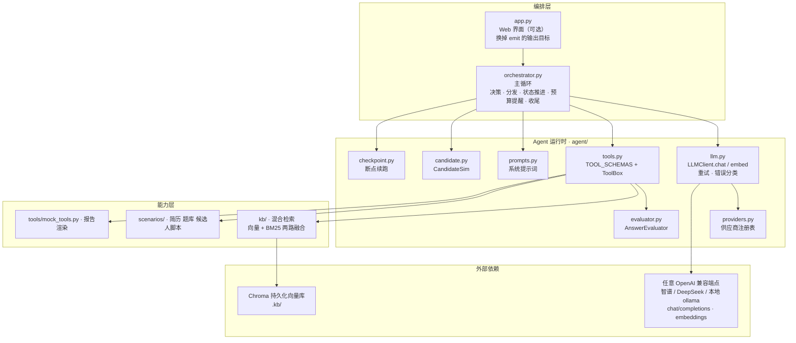

# MockMate 架构说明

> 这份文档描述的是**当前形态**：决策循环由 `orchestrator.py` 自己实现，不依赖 AgentTeams / Element / Matrix。
> 早期基于平台的形态见 `legacy/` 目录（5 Agent / 11 Skill / AgentTeams 配置，仅作提示词素材保留，不参与运行）。
>
> README 里是"能看懂"的版本，这里是"要上手改"的版本。

---

## 1. 一句话定位

**一个自己写的 ReAct 式调度循环**：把「对话历史 + 工具说明书」发给 LLM，
由 LLM 决定下一步是说话还是调工具，我们执行完把结果写回历史，循环到 LLM 自己调用 `end_interview` 为止。

没有 Agent 框架、没有 HTTP 工具网关、没有多进程编排。工具都是**进程内直调**。

---

## 2. 分层



**分层原则只有一条**：下层不知道上层的存在。
`kb/` 不知道谁在调它，`ToolBox` 不知道主循环长什么样，`LLMClient` 更不知道自己在扮演面试官。
所以每一层都能单独替换、单独测试。

---

## 3. 主循环

### 3.1 骨架

```python
while turn < max_turns and not toolbox.finished:
    turn += 1

    if 剩余轮数 <= 3 and 还没交报告:        # ⓪ 预算提醒
        注入一条 user 消息催它交报告

    reply = llm.chat(messages, tools=TOOL_SCHEMAS)   # ① 决策
    messages.append(reply.as_message())

    if reply.wants_tools:                  # ② 调工具
        for call in reply.tool_calls:
            ok, payload = toolbox.dispatch(name, args)
            messages.append({"role": "tool", "content": json.dumps(payload)})
        continue

    ...                                    # ③ 模型只是在说话 → 判断该不该给候选人回答的机会
```

### 3.2 三个必须理解的设计点

**① `messages` 是 Agent 唯一的记忆。**
每一轮都把整份历史重发一次。没有额外的"记忆模块"，也没有摘要压缩——
这是最简单、也最容易讲清楚的方案。代价是 token 随轮数线性增长（实测 32 轮约 27.8 万 in）。

**② 工具失败不抛异常。**
`dispatch()` 返回 `(ok, payload)`，业务错误（id 不存在、enum 非法）也走同一条通道写回 `messages`。
模型下一轮看到错误会自己换参数重试。**循环永远不会因为"模型调错了"而崩。**

**③ 停止条件由模型判断。**
`end_interview` 被调用时 `toolbox.finished = True`，循环自然退出。
`max_turns` 只是保险丝，不是正常退出路径。

### 3.3 分支 ③：该不该让候选人回答

这是整个循环里最容易写错的地方，三级判定：

| 顺序 | 条件 | 含义 |
|---|---|---|
| 1 | `toolbox.pending_question is not None` | 台上有题（刚 `pick_question` 出过）→ 必然是在提问 |
| 2 | 句子里有 `?` / `？` | 自由提问（项目深挖走这条） |
| 3 | `nod_streak >= 1` | 连着两轮没给出答案 → 强制给，防死循环的保险丝 |

命中任意一条 → 让 `CandidateSim` 作答，并以 `[候选人回答]` 前缀写回。
都不命中 → 注入「（候选人点了点头，等你提问。）」。

**为什么不用"有没有问号"单条判断？**
因为出题用的是「请实现……请说明……」这种祈使句，一个问号都没有。
第一版就是栽在这儿：模型被判成自言自语 → 注入点头 → 以为题没问出去 → 再问一遍……30 轮空转。

---

### 3.4 输出通道：所有输出只走一个口子（阶段 6）

```python
_sink: Callable[[str], None] = lambda text: print(text)   # 默认：打到终端

def emit(text: str = "") -> None:
    _sink(text)

def set_sink(sink: Callable[[str], None] | None) -> None:
    global _sink
    _sink = sink if sink is not None else (lambda text: print(text))
```

主循环里 55 处输出全部走 `emit()`。命令行下行为一个字不变（默认就是 `print`），
界面里 `set_sink()` 一换就接管了输出。

**界面为什么不直接重定向 `sys.stdout`**（本来是最省事的做法）：

1. Streamlit 是多线程的，重定向全局 stdout **不是线程安全的**；
2. 那样只能拿到一坨裸文本，拿不到「第几轮、调了哪个工具」这类结构化信息，
   页面里就做不出轮次卡片；
3. 已经被 stdout 混入无关内容坑过一次 —— 宿主的钩子日志混进过输出。

代价是 `orchestrator.py` 要动 55 处。验证方式：把 git 里的旧版本拉出来一起跑
`--list-providers` / `--list-runs`，**逐行比对**输出；再加一场 3 轮的真跑，
确认主循环内部那些输出（预算提醒、工具调用、面试官/候选人发言、统计块）都在。

`tests/test_emit.py::test_no_print_bypasses_the_channel` 是一条**结构约束**测试：
文件里不允许再出现绕过通道的裸 `print()`。
这类 bug 在命令行下完全看不出来，只有界面里会少几行 —— 属于最难发现的一种。

**界面里一律 `interactive=False`**：终端那套「限流了，等 60 秒 / 换模型 / 改 Key / 放弃」的菜单
要等人敲键盘，网页里没有键盘可敲。所以界面走无人值守分支 ——
出故障直接出一份「不完整但真实」的报告，配一个「从断点续跑」的按钮。
**断点（阶段 5 ③）在界面这一层的价值就在这里体现出来了。**

---

## 4. 会话状态

短期记忆全在 `ToolBox` 里，不散落：

| 字段 | 类型 | 用途 |
|---|---|---|
| `questions` | `dict[id, dict]` | 已出过的题。`score_answer` 靠它校验 id 合法性 |
| `records` | `list[dict]` | 逐题记录：题目 / 回答 / 分数 / 维度 / 评分来源 |
| `pending_question` | `dict \| None` | 台上有题待答（分支 ③ 的第一级判定） |
| `last_question` | `dict \| None` | 最近一道题。自由追问没有 id，靠它继承话题 |
| `custom_count` | `int` | 已登记的自拟题数量，用来生成 `custom-01` 这类合法 id |
| `report_path` | `str \| None` | 报告是否已落盘 |
| `finished` | `bool` | 循环退出标志 |

合法取值表是**写死在代码里**的常量（`VALID_TRACKS` / `VALID_DIFFICULTIES` / `VALID_STAGES`），
不是靠 Schema 里的 `enum`。原因见第 8 节的第 4 条。

---

## 5. 工具层

8 个工具，分三类：

| 类别 | 工具 | 说明 |
|---|---|---|
| 读取 | `read_resume` `fetch_jd` `search_jd_kb` | 简历、JD、向量检索（检索是**工具**，不是管线） |
| 出题 | `pick_question` `log_custom_question` | 题库题 / 自拟题登记（后者为了给项目深挖题一个合法 id） |
| 收尾 | `score_answer` `submit_report` `end_interview` | 逐题评分、交报告、结束 |

工具说明书就是标准的 JSON Schema（`TOOL_SCHEMAS`），直接塞进 `payload["tools"]`，
`tool_choice="auto"` 交给模型自己决定调不调。

---

## 6. 检索层（Agentic RAG）

```
knowledge/*.md  --(按 markdown 标题切小节)-->  chunks  --(kb/embed.py)-->  Chroma(.kb/, cosine)
                                                                                  ↓
            面试官调 search_jd_kb(query) ──┬─ 向量路（语义，能对上换个说法的问法）──┤
                                           └─ 关键词路 BM25（字面，专有名词更可靠）──┤
                                                                                  ↓
                                                          kb/fusion.py 融合 → top-k 片段
```

**和固定管线的分界线**：这里的检索结果不是被拼进 prompt 送给"答案生成器"，
而是作为**工具结果交回面试官自己**，由它决定查什么、查几次、怎么用。

检索层不抛异常：库是空的时候 `retrieve()` 返回 `[]`，由调用方回退到内置的少量情报。
"库没建"是**正常状态**，不是错误。

### 两路召回，为什么

向量路比**语义**：问「缓存击穿怎么答」能命中写着「热点 key 失效」的段落。
但它对**专有名词**很弱 ——「RDB」「Redlock」「TIME_WAIT」这类词在向量空间里和周边概念挤成一团。

关键词路（`kb/bm25.py`）正好补这一路：只看词有没有出现、出现几次、这个词在语料里有多稀有。
中文切词用**字符二元组**，不引 jieba —— 那要带一个几十 MB 的词典，和"clone 下来就能跑"相冲。
「缓存击穿」→ 缓存 / 存击 / 击穿，对专有名词精确命中足够用，且零依赖。

两种模式可以单独用：`retrieve(q, mode="vector" | "bm25" | "hybrid")`，默认 `hybrid`。

### 融合算法：为什么默认不是 RRF（`kb/fusion.py`）

第一版按教科书写了等权 RRF。**跑 20 个带标注的查询一量，它比两个单路都差**
（Hit@1 60%，关键词单路 70%）。原因不是 RRF 不好，是它和这种小列表不匹配：

- RRF 给每路的第 1 名都记 `1/(k+1)` 分 → **两路的第一名必然同分**，
  两路意见不一致时，谁在前只能靠 id 排序碰运气。
- 调 `k` 救不了：从 1 扫到 60，Hit@1 全是 60%。`k` 调大，8 条列表里第 1 名和第 8 名
  只差 11%（1/61 vs 1/68），融合退化成"数一条片段出现在几路里"；`k` 调小，第一名打平更突出。

现在默认 `normalized_sum`：每路**各自** min-max 归一化到 0~1 再等权相加。
名次差异被完整保留，两路又归到同一尺度，可以相加。
实测 Hit@1 70% / Hit@3 85%，与最强单路持平，**换说法型查询上 70%（单路最好 60%）** ——
那才是加这一层的初衷。完整对照表见 README 第 3 节。

三点如实说明：① 70% 与 60% 只差 20 个查询里的 2 个，不足以宣称"更准"，
站得住的是"第一名必然同分"那条结构性区别（有单测钉住）；
② 刻意给两路**等权** —— 给关键词路加权能把 Hit@3 刷到 90%，但那是过拟合这份语料；
③ 等权 RRF 没删，保留成 `fusion="rrf"`，换语料或换向量模型后还要重比。

### 向量化是谁算的（`kb/embed.py`）

`embed_texts()` 是**全项目唯一的向量化入口** —— 建库和检索都走它。
这条约束是有来历的：改造前 `kb/build.py` 和 `kb/search.py` 各写了一份
"读 Key → 建客户端 → embed"，想换 embedding 得改两个地方，
而**只改一处不会报错，只会让库和查询词落到不同的向量空间**。
那种错最难查：检索看起来还在工作，只是结果莫名其妙。

| `EMBEDDING_PROVIDER` | 行为 |
|---|---|
| `auto`（默认） | 有 `ZHIPU_API_KEY` 用智谱 `embedding-3`（2048 维），没有用本地 `bge-small-zh-v1.5`（512 维） |
| `zhipu` | 强制智谱。没 Key 直接报错，**不静默降级** |
| `local` | 强制本地模型（fastembed + onnxruntime，首次下载约 91MB，之后离线） |

`auto` 的那条降级路径是为了**免 Key 免网络**：评审 clone 下来不填任何配置，
`python -m kb.build` 也能建库、能检索。实测这个语料量级下
512 维与 2048 维的命中质量没有差别（对照表见 README 第 3 节）。

库的"身份"会写进 collection metadata（`embed_sig`，形如 `local:BAAI/bge-small-zh-v1.5`）。
检索前会比对一次：**不一致就明确报错并给出重建命令**。
不比对也不会报错 —— 相似度会静静变成噪声，这种失败方式比崩溃危险得多。
比的是 `provider:模型名` 而不是维度，因为维度相同 ≠ 向量空间相同。

### 切分策略

先按 markdown 标题（`#` ~ `####`）切小节，小节内再按段落聚合到 400 字，超长段落带 80 字重叠硬切。
每条片段前缀带上所属小节标题（`【2. 缓存击穿】`）。

为什么值得单独说：原来的做法是"任意位置的 400 字"，
实测问「缓存击穿」命中的片段开头却是「缓存雪崩」的正文——两个小节被切开又拼在了一起，
语义被稀释，相似度全线偏低。改成按标题切之后，一个片段 = 一个知识点。

---

## 7. 评分链路

### 7.1 双模型、双客户端

| | 面试官 | 评分官 |
|---|---|---|
| 职责 | 出题、追问、收尾 | 单题判分 |
| 调用频率 | 每轮都调 | 每题一次（无状态） |
| 失败策略 | **必须成功**，`max_retries=4`（429 时共等 70s） | **可以降级**，`max_retries=2`（10s+20s 就放弃） |
| 模型 | `glm-4.5-flash` / `glm-4.5-air` | `glm-4-flash-250414`（`SCORE_MODEL`） |

分开的两个理由：**智谱的 429 按模型报**，各占一份额度不容易一起被打满；
以及"必须成功"和"可以降级"是两种诉求，共用一个客户端就只能二选一。

### 7.2 评分器内部流程

```
score_answer(question_id, answer)
  → 取出题目 + 自带 scoring_rubric
  → 只发三条信息给评分模型：题目 / 参考要点 / 这一条回答   ← 不带对话历史
  → 模型返回各维度达成度（0~1）
  → 覆盖率检查（< 60% → 判失败）
  → 代码按 rubric 权重算加权总分（10 分制）
  → 连续 2 次失败 → 熔断，后续直接走规则打分
```

**判卷看不到对话历史是刻意的**：防止光环效应（同一条答案放在不同位置分数不一样，就没法横向比较），
顺带省掉大量 token。副作用是评分调用**无状态**，可以单独重跑某一题。

**加权总分由代码算，不由模型算**：模型做判断很行，做算术不稳，
让它自己算总分十次里会错两三次，而且错得悄无声息。

---

## 8. 失败处理

| 场景 | 处理 | 结果 |
|---|---|---|
| 429 限流 | 单独用 10s 基数退避（10→20→40s） | 覆盖一次分钟级限流窗口 |
| 5xx / 网络异常 | 3s 基数退避 | — |
| 401 / 403 等非限流 4xx | **不重试**，直接抛错 | 是我们自己的问题，重试没意义 |
| 评分失败 | 退回规则打分，标 `source=rule-fallback` | 报告里看得出哪几题是降级的 |
| 评分连续失败 2 次 | 熔断，后续题直接规则打分 | 不拿整场面试赌一道题 |
| 主循环 LLM 挂掉 | `break` + `submit_partial_report()` | **交一份残缺但真实的报告，而不是空白** |
| 模型交出 0 道题 | 运行结束时明确报警 | 提示"评分链路未生效" |
| 模型没交报告 | 运行结束时明确报警 | 报告才是这个产品真正的交付物 |

> **降级不是丢人的事，假装没降级才是。**

---

## 9. 关键文件索引

| 想改什么 | 改哪 |
|---|---|
| 循环行为、预算提醒、中断策略 | `orchestrator.py` |
| 主循环怎么往外写（换输出目标） | `orchestrator.py` 的 `emit()` / `set_sink()` |
| Web 界面长什么样 | `app.py`（Streamlit，`streamlit run app.py`） |
| 重试策略、超时、错误分类 | `agent/llm.py`（`RETRY_BASE`） |
| 供应商怎么认、Key 的变量名 | `agent/providers.py`（注册表） |
| 断点存什么、怎么续 | `agent/checkpoint.py` |
| 加工具、改入参校验 | `agent/tools.py`（`TOOL_SCHEMAS` + `ToolBox`） |
| 面试官行为准则 | `agent/prompts.py` |
| 候选人的回答和"认输"时机 | `agent/candidate.py` + `scenarios/*.answers.json` |
| 评分标准、维度、降级门槛 | `agent/evaluator.py` |
| 切分粒度、入库 | `kb/store.py` |
| 检索条数、两路怎么配合 | `kb/search.py` |
| 中文切词、BM25 参数（`K1` / `B`） | `kb/bm25.py` |
| 融合算法与权重 | `kb/fusion.py`（默认 `norm`，另有 `rrf`） |
| 语料 | `knowledge/*.md` → 改完跑 `python -m kb.build --rebuild` |
| 报告长什么样 | `tools/mock_tools.py`（`_render_markdown_report`） |
| 运行回放页长什么样 | `tools/build_replay.py` → 改完跑 `python tools/build_replay.py` 重新生成 |
| 检索质量有没有变差 | `python scripts/compare_retrieval.py`（20 个带标注查询的对照） |

### 运行回放页怎么来的

`docs/replay/index.html` 是**构建产物**，不是手写的 HTML：

```
docs/examples/run14_trace.json  ─┐
                                 ├─→ python tools/build_replay.py ─→ docs/replay/index.html
docs/examples/run14_report.json ─┘
```

两点设计考虑：

- **数据内联进 HTML**，不用 `fetch`。浏览器对本地文件（`file://`）的 fetch 有跨域限制，
  外链数据的话双击打开就是白屏。内联之后这一页是单文件：能双击、能邮件发、能丢进任何静态托管。
- **页面是产物而不是手抄的**，所以"这些数据是不是编的"这个问题可以被验证 ——
  重新生成一份、逐字节比对即可。手写的 HTML 做不到这一点。

### 改完怎么验证

```bash
python -m pytest tests -v     # 280 项，离线，不需要 API Key，实测约 3 秒
python e2e_test.py           # 工具链路端到端自检（也不调模型）
```

`tests/` 只测确定性逻辑，所以加功能时**先往这里加一条测试**比先跑整场面试划算得多
（整场面试要花额度、还会撞限流）。四条被测试钉住的设计约束：

- 评分请求不带对话历史（防光环效应）—— `test_evaluator.py::test_scoring_prompt_has_no_conversation_history`
- 降级打分必须打上 `source=rule-fallback` —— `test_tools.py::test_record_carries_source_and_dimensions`
- 题库里每个评分维度在提示词里都有中文释义 —— `test_evaluator.py::test_every_bank_rubric_dimension_has_a_hint`
- 两路各自的第一名在等权 RRF 下**必然同分** —— `test_hybrid.py::test_rrf_keeps_a_doc_found_by_only_one_route`
  （这条钉的是一个**已知短板**，不是设计。它正是默认融合不用 RRF 的原因，
  改断言前先看 `scripts/compare_retrieval.py` 的数字）

> 加工具时最容易忘的一件事：写了 `TOOL_SCHEMAS` 却忘了写 `_t_<工具名>`。
> `test_tools.py::test_schema_names_have_implementations` 会替你发现。

---

## 10. 扩展点

按"改动量从小到大"排：

1. **加一个场景** —— 复制 `scenarios/backend_intern.json` 改简历/JD/题库，再配一份 `.answers.json`（候选人脚本）。
2. **加一个工具** —— `TOOL_SCHEMAS` 里加一条 Schema，`ToolBox.dispatch()` 里加一个分支。**不用改主循环。**
3. **换模型 / 换供应商** —— `.env` 里改 `CHAT_MODEL`，或改 `DEFAULT_BASE_URL` 指向任何 OpenAI 兼容端点。
4. **加语料** —— 往 `knowledge/` 丢 markdown（或 PDF），`python -m kb.build --rebuild`。
5. **换 embedding** —— 已经抽好 provider 层（`kb/embed.py`）：改 `EMBEDDING_PROVIDER`
   或 `LOCAL_EMBEDDING_MODEL` 即可，建库和检索同时生效。换完记得 `--rebuild` ——
   注意真正的理由不是"维度可能对不上"，而是**向量空间不可比**。
6. **加一路召回** —— `kb/fusion.py` 的 `fuse()` 收的是 `[(id, 分数)]` 列表，
   加第三路（比如标题匹配、同义词扩展）就是多传一个列表。换融合算法则实现一个函数、
   挂到 `FUSIONS` 上。**但改完必须跑 `python scripts/compare_retrieval.py`** ——
   这里踩过一次：等权 RRF 看着最"标准"，实测比单路还差。别凭感觉说变好了。
7. **换供应商 / 换模型** —— 注册表在 `agent/providers.py`（按模型名自动认端点、
   认 Key 的变量名），错误分类在 `agent/llm.py`，断点续跑在 `agent/checkpoint.py`。
8. **Web 界面** —— 已经落地了（`app.py`）。它是怎么接上主循环的、以及为什么**不是**去重定向
   `sys.stdout`，见下面「输出通道」那一节。

---

## 11. 与早期形态的差异

| | 早期（平台配置包） | 现在 |
|---|---|---|
| 决策循环 | 跑在 AgentTeams 平台上 | `orchestrator.py` 自己实现 |
| 角色划分 | 5 个 Worker（Lead + 4 面试官） | **1 个 Agent**，靠工具和提示词分阶段 |
| 工具调用 | HTTP 工具网关（18090 端口） | 进程内直调 `ToolBox.dispatch()` |
| 上下文传递 | Lead 显式路由给 Worker | `messages` 一份历史全带 |
| Skill | 11 个独立 SKILL.md | 收敛进 `agent/prompts.py` 和工具实现 |
| 评分 | mock 按字数打分 | LLM 判断维度 + 代码算加权分 |
| 界面 | 无（跑在平台里） | 命令行 + Streamlit Web 界面（`app.py`） |

**为什么从 5 个 Agent 收敛成 1 个？**
因为"多 Agent"在早期形态里是**平台强制的形态**（每个 Worker 是一个独立会话），
不是问题本身需要的。真正的难点在"多轮时序 + 工具路径 + 失败恢复"，
这些在一个循环里反而更清楚。等单循环跑稳了，再按需拆——**而不是先拆再想为什么拆。**
