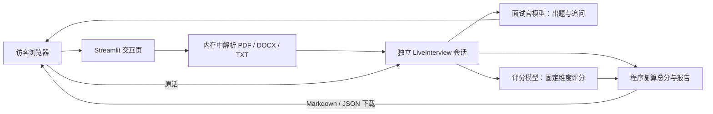

# 真人面试模式：运行与验收

## 两种入口

- `streamlit run live_app.py`：真人文字面试。上传/粘贴简历和 JD，自己提供 Key；服务器不写简历、回答、Key、报告或轨迹。页面可下载报告。关闭/清除会话后不支持历史回看。
- `streamlit run app.py` 或 `python -u orchestrator.py --scenario backend_intern`：原有脚本候选人演示，保留本地断点、轨迹和可复现的回放样例。

真人页现在明确选择服务商和其对应模型，不再靠自由输入模型名猜端点。智谱、DeepSeek 和阿里云百炼各用自己的临时 Key；切换服务商不会把上一个输入框里的 Key 发送给下一个服务商。公开入口只列云服务商，本地 `live_app.py` 额外提供无需 Key 的 Ollama。端点固定到所选供应商，避免服务器的通用环境变量把访客 Key 送往其他地址。面试过程中显示调用次数和 token 用量；这不是金额上限，实际费用仍以服务商账单为准。

| 选项 | 页面默认模型 | 使用条件 |
|---|---|---|
| 智谱 | `glm-4.5-flash` | 智谱开放平台 API Key，额度以账户为准 |
| DeepSeek | `deepseek-flash` | DeepSeek API Key，按其[官方计费](https://api-docs.deepseek.com/quick_start/pricing/)；旧 `deepseek-chat` 仅保留代码兼容 |
| 阿里云百炼 | `qwen3.5-flash` | 华北2（北京）百炼 API Key；先核对[免费额度和用完即停](https://help.aliyun.com/zh/model-studio/new-free-quota/) |
| 本机 Ollama | `qwen2.5:7b` | 仅本机入口：先安装 Ollama，运行 `ollama pull qwen2.5:7b` 并启动本地服务；不需要 Key。模型支持工具调用，但速度与评分质量需在本机验收 |

上述云服务商的端点、请求头、模型参数与 `ask_candidate` 工具调用已用模拟 HTTP 响应做离线契约测试；**尚未使用访客的 DeepSeek/百炼 Key 完成真实调用，也尚未在本机安装 Ollama 做整场实测**。请不要把这两类测试混为一谈。阿里云百炼的[模型能力说明](https://help.aliyun.com/zh/model-studio/text-generation-model)列出了所选模型的 Function Calling 支持。

真人模式的核心是 `agent/live.py` 中的 `LiveInterview`：`create()` 创建独立会话，`advance()` 推进至待答题，`submit_answer()` 保存用户原话并继续，`report()` 在结束后输出结构化报告。固定五个考察领域，每题最多两次追问。提问与追问仍使用模型工具调用；模型不参与录入考生答案，也不计算总分。评分模型失败的题目标为“未计分”，不会用按字数规则凑分。



真人模式不使用旧版脚本候选人、Chroma 知识库或磁盘断点；旧版仍保留供 Agent 工具链演示。整场最多两次追问，以限制真实用户的等待时间和模型成本。评分失败留下 `unscored` 与中断标记，缺题分时不显示总体评分。

## 本地验证

```bash
python -m pytest tests -q
python scripts/evaluate_live.py
```

第二条命令会用 `.env` 中的 `ZHIPU_API_KEY` 和 `CHAT_MODEL` 对三份**合成简历**完成真实模型面试，输出匿名问题、逐题分、评分来源、调用量和耗时。它会产生模型调用费用；没有 Key 时明确失败。可用 `--case rag_newgrad` 单独复测一个样例。人工复核需要逐题检查问题是否指向简历/JD、追问是否重复、证据是否来自回答，以及报告分数能否复算。未完成真实模型验证前，不应在简历中声称相关指标已达标。

一轮真实模型基线与人工复核结果见 [评测记录](evaluation-results.md)。它只证明合成用例可跑通和证据可逐字核对，未证明评分与真人一致；出题边界修改后尚待复测。

## 在线部署

首选 Streamlit Community Cloud：GitHub 仓库选择 `public/app.py` 作为入口，Python 3.12，部署工具会优先使用 `public/requirements.txt`。该入口只安装真人模式需要的轻量依赖，避免把原演示的 Chroma/FastEmbed 部署到公开实例。访客在页面填写自己的 Key；服务器不配置模型 Key。上线后从新浏览器验收“上传 → 确认 → 多轮回答 → 报告下载”，并用两个独立浏览器验证会话不串话。平台内存与休眠限制可能影响可用性，部署后需实际验证。
